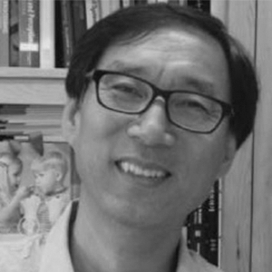
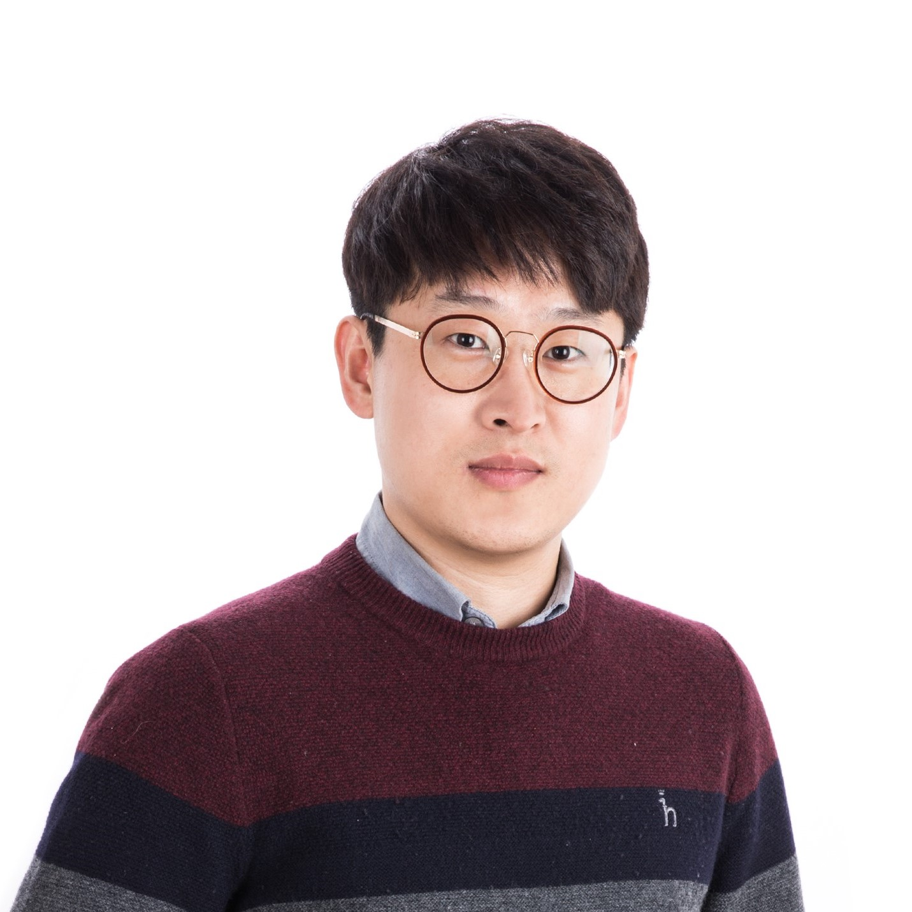
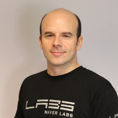
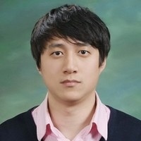
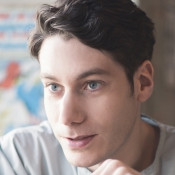

# Speakers

**Professor Kweon** received the B.S. and the M.S. degrees in Mechanical Design and Production Engineering from Seoul National University, Korea, in 1981 and 1983, respectively, and the Ph.D. degree in Robotics from the Robotics Institute at Carnegie Mellon University in 1990. He worked for Toshiba R&D Center, Japan, and joined KAIST in 1992. He is a professor of electrical engineering (EE) and the head of the Future Vehicle Division at KAIST. 
Professor Kweon's research interests include computer vision and robotics. He served the IJCV as an Editorial Board Member for 2005~2015.
Professor Kweon is a member of many computer vision and robotics conference program committees and has been a program co-chair for several conferences and workshops. Most recently, he is now serving as Program Chairs for ICCV'2019. Professor Kweon received several awards from the international conferences, including "The Best Student Paper Runnerup Award" from in the CVPR in 2009 and “The Best  Paper Award" from the IEEE T. of CSVT in 2014. 
 
 

**Deokhwa Kim** received his B.S. degree in media communication engineering from the Hanyang University in 2011. He received his M.S degree in robotics program from KAIST in 2013 and finished his Ph.D. degree in electrical engineering from KAIST in 2018. After graduation, he joined NAVER LABS, where he is currently working in the 3D Geometry team. His research interests include 3D vision, SLAM, and Robotics.
 
 

**Martin Humenberger** earned his Master's degree in computer engineering at the Upper Austrian University of Applied Science Hagenberg in 2004 and finished his Ph.D. studies in electrical engineering at Vienna University of Technology in 2011 with distinction. In 2013, he spent a year at NASA's Jet Propulsion Laboratory as Caltech Postdoc. Until November 2017, he was Senior Scientist with AIT Austrian Institute of Technology. He joined the Computer Vision group of NAVER LABS Europe in December 2017. Since September 2018 he leads the 3D Vision group where he combines geometric with learned information. His research interests are monocular as well as multi-camera vision, 3D vision, camera motion estimation, visual localization and mapping, mobile robotics, and machine learning. He is the author of several publications in these fields and organizer of related events.
 
 

**Donghwan Lee** received his Ph.D. in Electrical and Computer Engineering at Seoul National University in 2014. After spending 3 years at Samsung Electronics as a Senior Engineer, he joined NAVER LABS, where he is currently leading the 3D Geometry team. His research interests include 3D vision, visual localization ,visual SLAM,  machine learning, signal processing, and error correction codes (ECCs).
 
 
 

**François Rameau** received his Master degree in Vision and Robotics (VIBOT, Erasmus mundus) from the University of Burgundy in 2011. He completed his PhD degree untitled “Hybrid foveated vision system for video surveillance and robotic navigation” in December 2014 under the supervision of Prof. Cedric Demonceaux.In 2015, he worked as a full time postdoctoral researcher in KAIST (Daejeon, South Korea). He is nowadays a Research Professor in RCVlab funded by the National Research Foundation of Korea . His research interests include 3D reconstruction, assisted and cooperative driving, robotics, visual tracking and omnidirectional vision.

